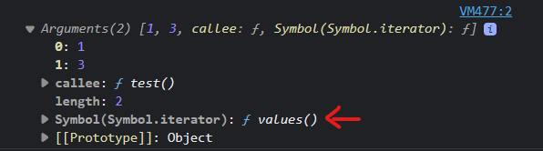

# Javascript Everyday

> Những kiến thức này sẽ được lấy từ nhiều nguồn và translate sang tiếng Việt.

> 1. https://www.javascripttutorial.net/

## Argument vs. Parameter

<p align="center" width=100%>
    
</p>

## Argument object

- Argument object trong một function là gì. Mình lấy ví dụ:

```javascript
function example() {
  console.log(arguments[0]); // 1
}
example(1, 3);
```

- Nhìn có vẻ giống một array, nhưng nó KHÔNG phải là một instance của Array

```javascript
function example() {
  return arguments.filter((x) => x > 0); //arguments.filter is not a function
}
example(1, 2, 3, 4);
```

- Nó là một `iterable`.
<p align="center" width=100%>
    
</p>

- `Arrow Function` KHÔNG có Argument Object.

## Rest parameter

- Rest parameter `...` phải được xuất hiện ở cuối:

```javascript
function fn(a,...rest, b) {
 // error, nếu chuyển rest xuống cuối thì rest là Array không phải Argument object
}
```

- Gom 1 đóng lại thành một array mới:

```javascript
let [x, y, ...args] = [70, 80, 90, 100];
//args = [90, 100]
```

## Spread operator

- Cũng là `...` nhưng xuất hiện bất kì ở đâu ngoại trừ vị trí của rest(vì nếu ở đó thì gọi là rest rồi).

- Spread trong Array hoặc một iterable object (Map, Set):

```javascript
const odd = [1, 3, 5];
const combined = [2, ...odd, 4, 6];
console.log(combined); //[ 2, 1, 3, 5, 4, 6 ]
```

- Spread trong Object(ES2018):

```javascript
const hien = {
  name: 'hien',
};
const student = {
  ...hien,
  age: 1998
};

console.log(student);
/*
{
     name: 'hien',
     age: 1998
}
/*
```

- Các trường hợp hay dùng:

  - Push element vào array:

    ```javascript
    const a = [1, 2];
    const b = [3, 4];
    b.push(...a); //push từng phần tử
    //khác với
    b.push(a); // push 1 phần tử
    ```

  - Nối mảng

    ```javascript
    const a = [1, 2];
    const b = [3, 4];
    const c = [...a, ...b];
    ```

  - Clone một array mới(chỉ là shallow copy):

    ```javascript
    const a = [1, [2, [3]]];
    const b = [...a];
    // b[1] === a[1]
    ```

  - Clone object mới(chỉ là shallow copy):

    ```javascript
    const hien = {
      name: "hien",
    };
    const student = {
      hien,
      age: 1998,
    };
    const teacher = {
      ...student,
    };
    console.log(teacher);
    //student.hien === hien
    ```

  - Nối object:
    ```javascript
    const hien = {
      name: "hien",
    };
    const student = {
      age: 1998,
    };
    const teacher = {
      ...student,
      ...hien,
    };
    console.log(teacher);
    ```

## Destructuring

- Object:

  > let { property1: alias1, property2: alias2 = defaultIfUndefined} = object != null || {};

  > Thường dùng destructuring trong function. ({a,b}) => a+b

- Array:
  > let [property1: alias1, property2: alias2 = defaultIfUndefined] = array != null || [];
  ```javascript
  const [a, b, c] = [1, 2, 3];
  //let a = 1, b = 2, c = 3;
  ```
